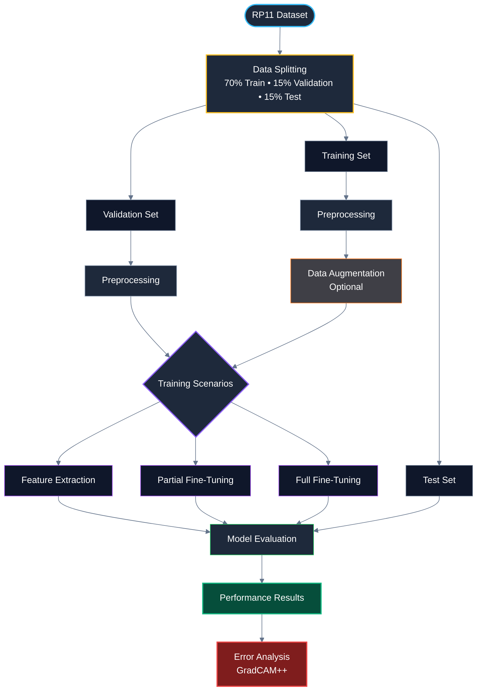

# 🌾 Perbandingan Kinerja Arsitektur EfficientNet-B4 dan Inception-V3 pada Klasifikasi Hama Tanaman Padi

Repository ini merupakan implementasi dari penelitian skripsi yang membandingkan kinerja dua arsitektur *Convolutional Neural Network* (CNN), yaitu **EfficientNet-B4** dan **Inception-V3**, dalam mengklasifikasikan hama tanaman padi menggunakan **dataset RP11 (subset dari IP102)**. Penelitian ini bertujuan untuk mengevaluasi kemampuan kedua model dalam mengenali 11 kelas hama berdasarkan citra digital melalui pendekatan *transfer learning*.

Eksperimen dilakukan dengan menerapkan tiga skenario fine tuning, yaitu **Feature Extraction**, **Partial Fine-Tuning**, dan **Full Fine-Tuning**. Selain itu, setiap strategi diuji pada dua skenario pelatihan, yaitu **dengan augmentasi data** dan **tanpa augmentasi data**, untuk menganalisis pengaruhnya terhadap performa model. Evaluasi dilakukan menggunakan metrik **Accuracy, Precision, Recall,** dan **F1-score**, serta dilengkapi dengan analisis kesalahan (*error analysis*) dan pendekatan **Explainable Artificial Intelligence (XAI)** menggunakan **GradCAM++** untuk memvisualisasikan area citra yang menjadi dasar pengambilan keputusan model. 

---

## 🛠️ Tech Stack & Tools

-blue?style=for-the-badge)

---

## 📂 Dataset

Penelitian ini menggunakan **RP11 (Rice Pest 11)**, yaitu dataset yang diperkenalkan oleh **Ding et al. (2025)** sebagai subset dari **IP102** yang berfokus pada citra **hama padi fase dewasa (adult stage)**. Dataset ini dipublikasikan melalui Kaggle dan dirancang untuk mendukung penelitian klasifikasi hama tanaman padi.

**📌 Dataset Information**

- **Dataset Name:** RP11 (Subset of IP102)
- **Source:** Ding et al. (2025)
- **Platform:** Kaggle
- **Dataset Link:** https://www.kaggle.com/datasets/dingbiao11/rp11-a-dataset-focus-on-adult-rice-pest
- **Total Images:** **4,559**
- **Number of Classes:** **11 Rice Pest Categories**

### 📊 Class Distribution

| No | Pest Category | Description | Images |
|:--:|---------------|-------------|-------:|
| 1 | Curculionidae | Small beetles that damage rice leaves and roots during the early growth stage. | 824 |
| 2 | Delphacidae | Rice planthoppers that suck plant sap, causing yellowing and drying of rice plants. | 729 |
| 3 | Cicadellidae | Leafhoppers that feed on plant sap and may transmit plant diseases. | 636 |
| 4 | Phlaeothripidae | Small sap-sucking insects that inhibit rice plant growth. | 290 |
| 5 | Cecidomyiidae | Gall midges that attack the growing point of rice plants, preventing panicle formation. | 373 |
| 6 | Hesperiidae | Leaf-feeding caterpillars that consume rice foliage. | 393 |
| 7 | Crambidae | Stem borers and leaf feeders that damage rice stems and leaves. | 461 |
| 8 | Chloropidae | Small flies that attack young rice stems and inhibit plant growth. | 153 |
| 9 | Ephydridae | Leaf-feeding pests that cause spots and damage on rice leaves. | 167 |
| 10 | Noctuidae | Caterpillars that damage rice leaves and stems, reducing crop yield. | 206 |
| 11 | Thripidae | Thrips that cause leaf yellowing and stunt rice plant growth. | 330 |
| **Total** | **11 Classes** |  | **4,559** |

---

## ⚙️ Alur Penelitian

Penelitian ini menerapkan alur kerja (*End-to-End Deep Learning Pipeline*) yang sistematis untuk memastikan setiap tahapan, mulai dari persiapan data, pelatihan model, evaluasi kinerja, hingga interpretasi hasil menggunakan *Explainable Artificial Intelligence (XAI)*, dilakukan secara terstruktur.

---

## 🧠 Arsitektur Model

Penelitian ini membandingkan dua arsitektur *Convolutional Neural Network (CNN)* yang telah dipra-latih (*pre-trained*) pada dataset **ImageNet** dan diimplementasikan menggunakan pendekatan *transfer learning*.

| Architecture | Description | Input Size |
|-------------|-------------|-----------:|
| **EfficientNet-B4** | CNN berbasis *compound scaling* yang menyeimbangkan kedalaman (*depth*), lebar (*width*), dan resolusi citra (*resolution*) untuk memperoleh performa tinggi dengan jumlah parameter yang efisien. | **380 × 380** |
| **Inception-V3** | CNN yang menggunakan modul *Inception* untuk mengekstraksi fitur multi-skala secara efisien dengan kompleksitas komputasi yang lebih rendah. | **299 × 299** |

---

## 🧪 Skenario Pengujian

Penelitian ini mengevaluasi dua arsitektur CNN, **EfficientNet-B4** dan **Inception-V3**, menggunakan enam skenario eksperimen yang merupakan kombinasi dari tiga strategi *transfer learning* dan dua konfigurasi pelatihan (dengan dan tanpa augmentasi).

| Scenario | Fine-Tuning Strategy | Data Augmentation | Description |
|----------|----------------------|-------------------|-------------|
| Scenario 1 | Feature Extraction | ❌ Without | Seluruh backbone dibekukan, hanya classifier yang dilatih. |
| Scenario 2 | Feature Extraction | ✅ With | Backbone dibekukan, classifier dilatih menggunakan data hasil augmentasi. |
| Scenario 3 | Partial Fine-Tuning | ❌ Without | Sebagian layer akhir backbone dan classifier dilatih tanpa augmentasi. |
| Scenario 4 | Partial Fine-Tuning | ✅ With | Sebagian layer akhir backbone dan classifier dilatih menggunakan augmentasi. |
| Scenario 5 | Full Fine-Tuning | ❌ Without | Seluruh parameter model dilatih tanpa augmentasi. |
| Scenario 6 | Full Fine-Tuning | ✅ With | Seluruh parameter model dilatih menggunakan data hasil augmentasi. |

---

## ⚙️ Konfigurasi Parameter

Seluruh eksperimen dilakukan menggunakan konfigurasi pelatihan berikut:

| Parameter | Configuration |
|-----------|---------------|
| Framework | PyTorch |
| Testing Scenario | Feature Extraction, Partial Fine-Tuning, Full Fine-Tuning |
| Data Augmentation | With Augmentation & Without Augmentation |
| Optimizer | Adam, AdamW |
| Learning Rate | 1e-3, 1e-4 |
| Scheduler | ReduceLROnPlateau, StepLR, CosineAnnealingLR |
| Batch Size | 32 |
| Loss Function | CrossEntropyLoss |
| Early Stopping | Patience = 5 |
| Input Size | 380×380 (EfficientNet-B4), 299×299 (Inception-V3) |
| Pretrained Weights | ImageNet |
